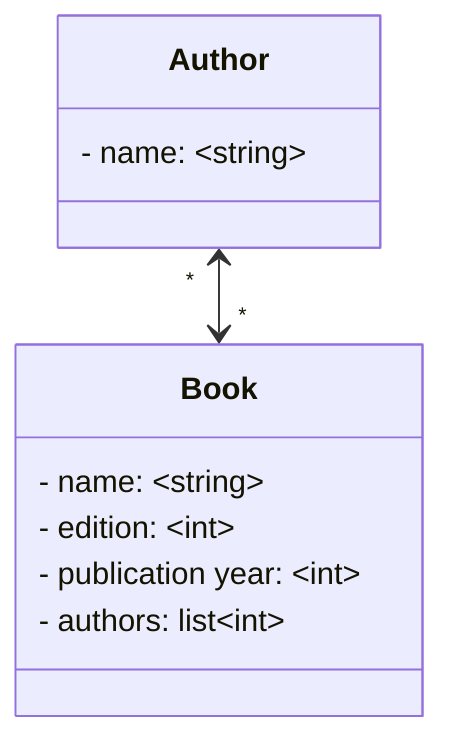

[](https://codecov.io/gh/fczanetti/work-at-olist)


# Work at Olist

Welcome to work-at-olist project documentation!

This project was developed to solve the challenge proposed by Olist. It consists of an API to store names of authors and books written by them. The requirements were to create a management command to import and save the names of the authors from a .csv file, and also a CRUD to manage the books. An important detail is that a book can be written by more than one author, so a many-to-many relations was used to create the database. Some filters were also created to retrieve books or authors, but these were optional.

More details can be checked in [their requirements](https://github.com/fczanetti/work-at-olist/blob/main/olist_instructions.md). You can also visit the [original repository](https://github.com/olist/work-at-olist).

## Database




## Folder structure

```
├── 📂 work-at-olist
|   ├── 📂 contrib
|   |   ├── env-sample
|   ├── manage.py
|   ├── Pipfile
|   ├── Pipfile.lock
|   ├── authors.csv
|   ├── 📂 work_at_olist
|   |   ├── api.py
|   |   ├── urls.py
|   |   ├── settings.py
|   |   ├── 📂 base
|   |   |   ├── api.py
|   |   |   ├── books.py
|   |   |   ├── customizations.py
|   |   |   ├── models.py
|   |   |   ├── schemas.py
|   |   |   ├── 📂 management
|   |   |   |   ├── 📂 commands
|   |   |   |   |   ├── import_authors.py
|   |   |   ├── 📂 tests
```